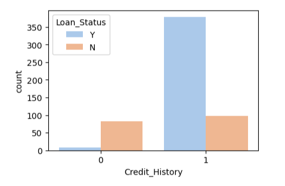
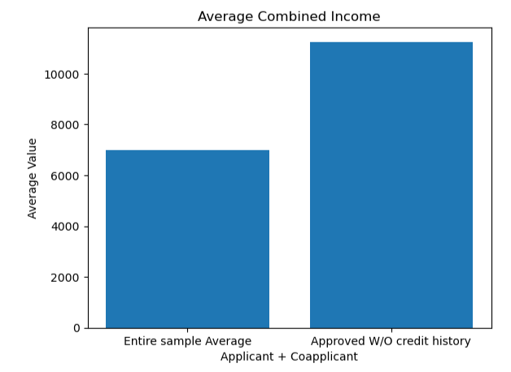
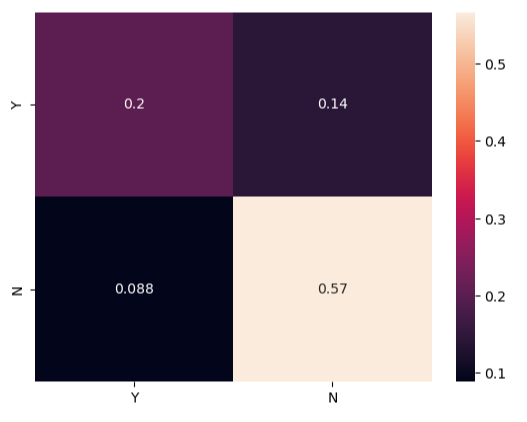

# Loan Eligibility
### Data analysis and ML preditcion of loan status

In this mini-project we will analyze the small data-sample (614 rows by 13 columns) and will try to build a machine-learning model in order to predict approval or denial of the loan application.

## 1. Data exploration and cleaning
        In this section I have standartized the data-set, brought column names to standard form, dropped unnecessary colum and removed NaN-values by filling categorycal values with MEDIAN and variables with MEAN per each column. 

        I had to remove about 50 rows because there were NaN-values in Credit History column, that would heavily influence the results if I would fill them with information that is not correct.

## 2. EDA

### Key take-aways from data visualization:

- Data sample mostly represents Male candidates 
- Married canditates are twice as common 
- Biggest part is not self-employed and has higher education.
- More than 50% of population does not have dependants while being nearly equaly spread across three living area types. 
- It is also clear that we have more than twice amount of 'Y' in Loan_Status over 'N' (our target variable).

    

### Numerical:

- The only clearly correlated feature to target visible is Credit_History. If applicant has previous credit history - then it is most likely they will receive the loan approval, opose to having no credit history, where, in our data set the amount of aprovals for candidates without credit history is very sall (less than 10 cases).

    

- Applicants with higher incom tend to request a bigger loan amount.

    

## 3. Loan Status Analysis 

- Comparing incomes for approved applications with and without credit history, we can see that approved without credit history had a much higher variance. Additionaly, the sum of applicant and coapplicant incomes are heigher. Meanwhile all the rest plots of continuous variables remain about the same as in initial sample. 

     

     

    

- As we can see from below, 'Applicant' and 'Coapplicant' income of 'Denied Loans Applications with Credit History status 1' is about the same as the 'Entire Sample's' Income in avarage with higher variance, so I would argue that there is probably no strong correlation.

    

- The plots of 'Entire Sample' and 'Loans Denied With Credit History 1' look fairly similar either. On the other hand, just few records of 'Approved Loans without Credit History' have a big part of it represented by cases with higher amount of dependents than avarage.

    

## 3. Building Machine Learning Model

- First attempt brought me the succesfull prediction of 19% of "Y" statuses and 65 % of "N" statuses. 

- After I applied oversampling the "Y" and "N" rows were equalized in the train dataframe. Having this applied, I was able to get results of 20% correct "Y" predictions and 57 % correct "N" predictions.

## Conclusion

        The results in predicting the the loan status with the logistics regression model could be better.
         Oversampler have helped to balanced out the data a bit, but we lost too much value for 'N' predictions, while did not gain a lot in 'Y'. Standartizing the data-frame increased the numbers of succesful predictions by very small part.
        Perhaps, I would have better results having mroe data to analyze, or if I tried more tools such as normalization and other ML tools. Nevertheless I was able to still visuallize some data that could bring interesting insights. For instance:

- Most of the applicants with loans status approved had a credit history
- Applicants with approved loans without credit history had a higher income/ or their coapplicants had a higher income than avarage data sample
- Applicants with approved loans without credit history more often have more than 3 dependants. This might be reasoned by special government policy or quote for bigger families

## FIN

     

